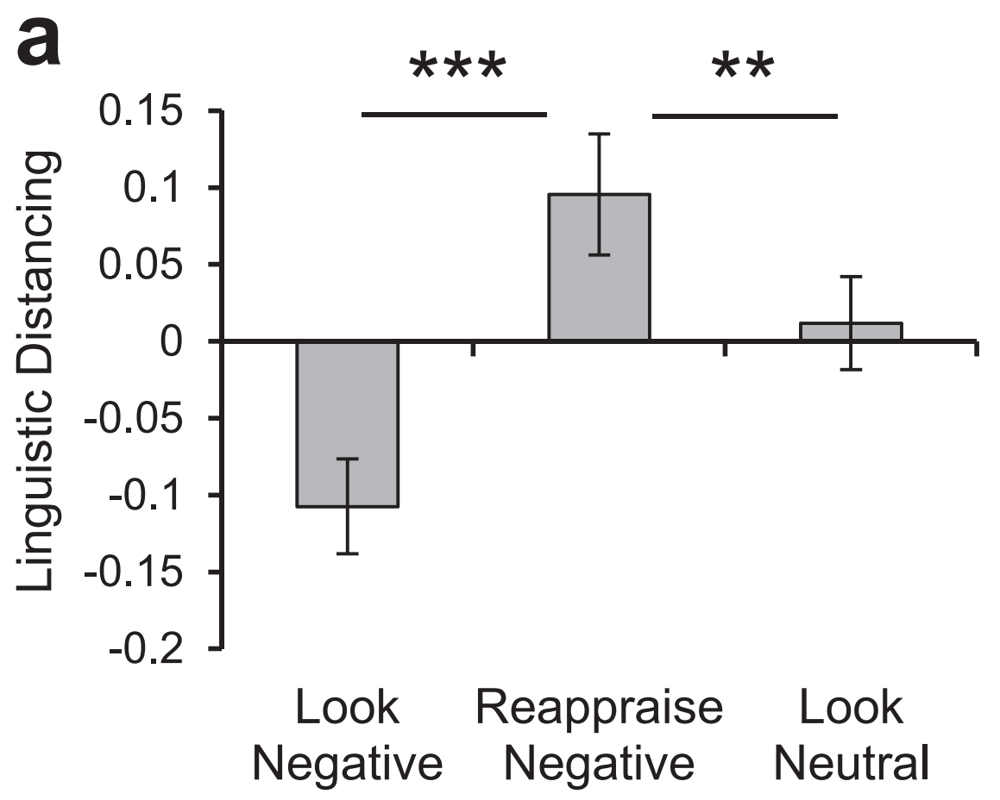
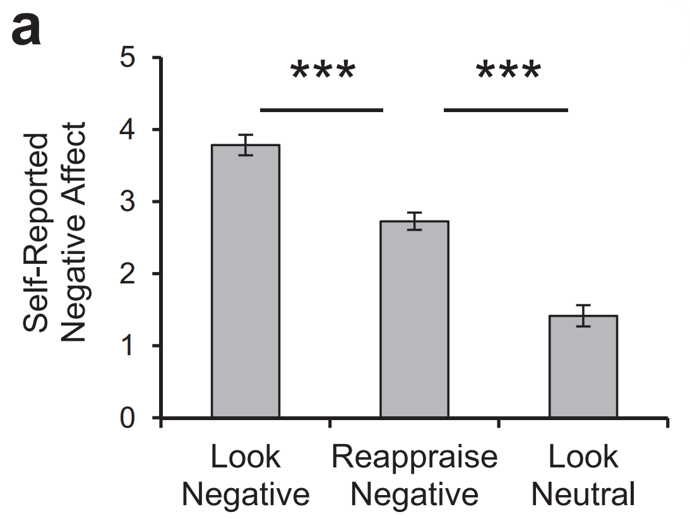
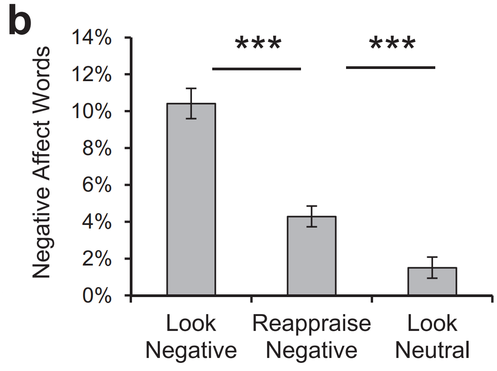
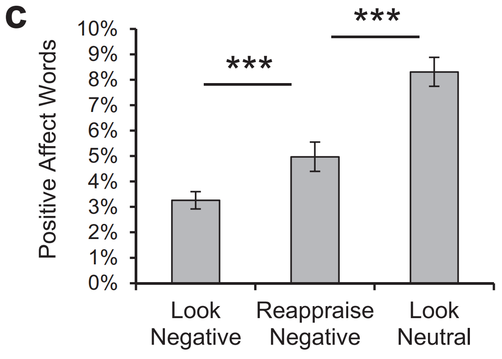

## Introduction

Psychological distancing is the psychological process of imagining events as far away (temporally or socially) during emotion regulation. Imagining upsetting images and social situations as happening far away or from a third-person perspective reduces self-reported negative affect (Davis, Gross, & Ochsner, 2011) and reduces biological indices of emotional arousal, like blood pressure and amygdala activity (Ayduk & Kross, 2010).

There are linguistic markers in speech which are indicative of the degree of psychological distance employed by a speaker. Nook et al. (2017) explore bidirectional relations between emotion regulation and linguistic signatures of psychological distancing.

Study 1 assessed (1) whether people spontaneously distance their language when regulating emotions and (2) whether the tendency to use more psychologically distant language when regulating emotions is associated with more successful regulation; it found that emotion regulation increased linguistic markers of temporal and social distance, and participants who showed greater linguistic distancing were more successful regulators. These are the findings we seek to replicate.

The original researchers adapted Ochsner, Bunge, Gross, & Gabrieli's (2002) emotion regulation paradigm for use on Amazon Mechanical Turk (MTurk). The original stimuli consisted of two lists of 20 negative images and one list of 20 neutral images from the Open Affective Standardized Image Set (OASIS; Kurdi, Lozano, & Banaji, 2016). 115 MTurk participants saw the cue word "LOOK" or "CHANGE" above an image for 30 seconds, which indicated whether they should react naturally or regulate their emotions by reappraising the meaning of the image, respectively. Participants were instructed to transcribe what they were thinking and feeling into a textbox. The original researchers used Pennebaker's Linguistic Inquiry and Word Count program (LIWC; Pennebaker, Chung, Ireland, Gonzales, & Booth, 2007) to analyze text entries.

### Justification for Choice of Experiment

Currently, my research investigates young children's implicit understanding of linguistic politeness. I envisage my future work focusing more broadly on language in social contexts, principally on how children and adolescents use language to construct and reconstruct interpersonal relationships. Emotion regulation plays a crucial role in the way children and adolescents perceive and relate to their environment, and is fundamental to developing successful relationships, which is why I deem it relevant to my research interests.

Link to project repository: https://github.com/psych251/nook2017

Link to original paper: https://github.com/psych251/nook2017/blob/master/original_paper/nook2017.pdf

Link to pre-registration: https://osf.io/92der

## Methods

### Power Analysis

A power analysis in G*Power indicated that 63 participants were required to observe a within-subjects emotion regulation effect (estimated d = 0.36) at p < 0.05 and 80% power. As per the original author's power analysis, the estimated effect size was based on a 2012 emotion regulation meta-analysis (Webb, Miles, & Sheeran). To observe the same effect with 90% power, 84 participants are required. To observe the same effect with 95% power, 103 participants are required.

Due to funding limitations, we may only be able to run 60 participants. If this replication is run with 60 participants, it will be able to detect the estimated effect with 78% power; however, the final power may be less than 78% after accounting for exclusions.

### Planned Sample

Like the original Nook et al. study, our replication will sample from MTurk workers located in the United States who have at least a 95% task approval rate.

The original researchers "excluded eight participants who consistently progressed through trials without writing for a full 30 s and five who wrote about topics other than the images". Responses will be automatically submitted after 30 seconds. 

In our replication, participants will be excluded if:

- They fail the attention check. (At the end of the survey, participants will be presented with 9 images: 5 from the survey and 4 others. Participants will be asked to select the images that were part of the survey.)
- They progress through five or more trials before 30 seconds has elapsed.
- Five or more of their written responses do not cite any negative thoughts or emotions.
- Five or more of their written responses refer to topics other than the images.
- Two or more of their written responses are word-for-word repeats of another written response.

To ensure compliance with federal minimum wage, participants will be paid $1.50.

### Materials

The original researchers "assembled three lists of 20 images from the Open Affective Standardized Image Set (OASIS; Kurdi, Lozano, & Banaji, 2016). One list included only neutral images... The other two lists were both negative, and they were matched for valence (List A: M  = 2.37, SD  = 0.42; List B: M = 2.38, SD = 0.42; item analysis t(38) = -0.12, p = .906) and arousal (List A: M = 4.24, SD = 0.56; List B: M = 4.25, SD = 0.50; t(38) = -0.06, p = .954)." The authors used these sets to test three conditions: (a) look negative, (b) reappraise negative, and (c) look neutral.

Our replication will only include two lists (look negative and reappraise negative) of 10 images. While the specific images we will use differ from those in the original study, our image lists have been matched for valence (List A: M = 2.32, SD = 0.41; List B: M = 2.31, SD = 0.37; t(18) = 0.08, p = .940) and arousal (List A: M = 4.33, SD = 0.55; List B: M = 4.36, SD = 0.57; t(18) = -0.11, p = .912), and are comparable to the originals.

In the original study, participants were shown the 60 images, each with "the cue word 'LOOK' or the cue word 'CHANGE' above... for 30 s... Participants were told that the cue word 'LOOK' meant that they should 'just look at the picture and let yourself feel whatever that image makes you feel.'... The cue word 'CHANGE' indicated that they should regulate their emotions by reappraising the meaning of the image (Gross, 1998, 2015). Critically, participants were not instructed to reappraise the image by imagining it as far away from them. Instead, they were instructed to reinterpret the meaning of the image to make it less negative (e.g. imagine that the objects are fake or that something good is about to happen)."

Our replication will follow the original authors' procedure as detailed above.

The replication paradigm has been set up on Qualtrics and linked for use on MTurk. 

Link to paradigm: https://stanforduniversity.qualtrics.com/jfe/form/SV_1SKBE3Rkzs7qibz

### Procedure	

In the original study, participants "transcribed what they were thinking and feeling about the image into a textbox that appeared below the image" then "rated how they were feeling on a 7-point scale (1 Not bad at all to 7  Extremely bad)." They "completed 20 trials of each condition" and "reported their age, gender, race, and annual family income at the end of the survey."

"Mapping of list and condition was counterbalanced across participants."

We will precisely follow the original procedure as detailed above, except participants will complete 10 trials of each condition and the mapping of the lists will be randomized as opposed to counterbalanced.

### Analysis Plan

The original researchers "computed each participant’s average negative affect rating for trials in each condition" and "used Pennebaker’s Linguistic Inquiry and Word Count (LIWC) program to analyze text entries for each trial" (Pennebaker et al., 2007). Text entries were proofread for spelling before analysis.

Nook et al. "focused linguistic analyses on (a) negative affect words (e.g., hurt, nasty, worried, sad, crying, annoyed), (b) positive affect words (e.g., love, nice, sweet, happy, laughing, cute), and (c) a composite linguistic measure of psychological distancing" (following Mehl, Robbins, & Holleran, 2012). To compute this measure, Nook et al. "z-scored use of first-person singular pronouns (e.g., I, me, my), present-tense verbs, articles (the, a, an), discrepancy words (e.g., would, could, should), and words of more than six letters across trials." They then "reverse-scored the z-scored frequencies of first-person singular pronouns, present-tense verbs, and discrepancy words by multiplying them by -1 and averaged these with the z-scored frequencies of articles and words of more than six letters for each trial." They "averaged this measure of linguistic distancing across trials within each condition for each participant."

To test whether people spontaneously distance their language when regulating emotions, one must determine whether participants' average use of linguistic distancing words (mean z-scored frequencies) differ significantly across conditions. Nook et al. "used repeated-measures analyses of variance (ANOVAs) to test for significant differences across the three conditions." When significant effects emerged, they "conducted follow-up paired-samples t tests [a **key analysis of interest**] to assess for differences between the reappraise negative condition and the other two conditions."

To test whether the tendency to use more psychologically distant language when regulating emotions is associated with more successful regulation, one must determine whether there is a statistically significant correlation between the extent to which participants increase their use of words encoding psychological distance and the extent to which participants reduce their negative affect when regulating. Nook et al. "created a measure of reappraisal success for each participant by subtracting their average negative affect rating for images in the reappraise negative condition from their average rating for images in the look negative condition." They then "created analogous measures of how much each participant modulated their language when regulating their emotions by subtracting each participant’s average frequency of negative affect words, positive affect words, and linguistic distancing words in the look negative condition from their average use in the reappraise negative condition." Nook et al. "used Pearson’s correlations [a **key analysis of interest**] to test the hypotheses that higher reappraisal success scores would be associated with reduced use of negative affect words, increased use of positive affect words, and increased linguistic distancing."

We will precisely follow the original analysis plan as detailed above.

### Differences from Original Study

To ensure compliance with federal minimum wage, participants will be paid $1.50 for their time.

Our replication will only include two lists (look negative and reappraise negative) of 10 images. We will use the same standard to select and group images from OASIS; however, the specific images will differ from those used in the original study. 

The paradigm will be set up on Qualtrics and linked for use on MTurk.

In our replication, participants will be excluded if:

- They fail the attention check. (At the end of the survey, participants will be presented with 9 images: 5 from the survey and 4 others. Participants will be asked to select the images that were part of the survey.)
- They progress through five or more trials before 30 seconds has elapsed.
- Five or more of their written responses do not cite any negative thoughts or emotions.
- Five or more of their written responses refer to topics other than the images.
- Two or more of their written responses are word-for-word repeats of another written response.

### Methods Addendum (Post Data Collection)

#### Actual Sample

In our replication, we originally planned to exclude participants if:

- They failed the attention check. (At the end of the survey, participants were presented with 9 images: 5 from the survey and 4 others. Participants were asked to select the images that were part of the survey.)
- They progressed through five or more trials before 30 seconds had elapsed.
- Five or more of their written responses did not cite any negative thoughts or emotions.
- Five or more of their written responses referred to topics other than the images.
- Two or more of their written responses were word-for-word repeats of another written response.

After collecting our data, it was clear that the planned exclusion criteria we too strict, as we would have excluded a significantly greater proportion of participants than in the original study. In the below analyses, we have only excluded participants who failed the attention check, leaving 56 participants included in analyses (age: range = 23 - 65, M = 35.5, SD = 8.95; gender: 35 male, 21 female; race: 46 White/Caucasian, 4 Black/African American, 3 Asian/Asian American, 1 American Indian/Alaska Native, 0 Native Hawaiian/Pacific Islander, 2 Other).

#### Differences from Pre-Data Collection Methods Plan

Our replication used the same task instructions as the original study, with a few additional sentences to inform participants that their responses would submit automatically after 30 seconds and to encourage participants to pay attention. See project repository for a full comparison.

In our pre-registered procedure, we detailed that the "the mapping of the lists will be randomized as opposed to counterbalanced": a mistype. In our replication, the mapping of list and condition was counterbalanced across participants. The _order_ in which individual images were presented was randomized.

Participants were not asked to report annual family income as originally planned, but they were still asked to report their age, gender, and race at the end of the survey. These questions were not required fields.

## Results

### Data Preparation

```{r load libraries, message=FALSE, warning=FALSE}
library(tidyr)
library(stringr)
library(ggplot2)
library(Rmisc)
library(dplyr)
library(ggsignif)
library(rstatix)
library(ggpubr)
```

```{r import data}
csv <- read.csv("nook2017anonymized_data.csv")
```

```{r tidy data}
df.tidy <- csv %>% 
  
  # Remove unnecessary variables.
  select(-c(EndDate, Status, Progress, Duration..in.seconds., Finished, RecordedDate, UserLanguage, ends_with("Click"), ends_with("Count"), mTurk )) %>% 
  
  # Tidy data.
  unite("look1", "look1time_Page.Submit", look1, look1feeling, sep="__") %>% 
  unite("look1c", "look1ctime_Page.Submit", look1_c, look1feeling_c, sep="__") %>% 
  unite("look2", "look2time_Page.Submit", look2, look2feeling, sep="__") %>% 
  unite("look2c", "look2ctime_Page.Submit", look2_c, look2feeling_c, sep="__") %>% 
  unite("look3", "look3time_Page.Submit", look3, look3feeling, sep="__") %>% 
  unite("look3c", "look3ctime_Page.Submit", look3_c, look3feeling_c, sep="__") %>% 
  unite("look4", "look4time_Page.Submit", look4, look4feeling, sep="__") %>% 
  unite("look4c", "look4ctime_Page.Submit", look4_c, look4feeling_c, sep="__") %>% 
  unite("look5", "look5time_Page.Submit", look5, look5feeling, sep="__") %>% 
  unite("look5c", "look5ctime_Page.Submit", look5_c, look5feeling_c, sep="__") %>% 
  unite("look6", "look6time_Page.Submit", look6, look6feeling, sep="__") %>% 
  unite("look6c", "look6ctime_Page.Submit", look6_c, look6feeling_c, sep="__") %>% 
  unite("look7", "look7time_Page.Submit", look7, look7feeling, sep="__") %>% 
  unite("look7c", "look7ctime_Page.Submit", look7_c, look7feeling_c, sep="__") %>% 
  unite("look8", "look8time_Page.Submit", look8, look8feeling, sep="__") %>% 
  unite("look8c", "look8ctime_Page.Submit", look8_c, look8feeling_c, sep="__") %>% 
  unite("look9", "look9time_Page.Submit", look9, look9feeling, sep="__") %>% 
  unite("look9c", "look9ctime_Page.Submit", look9_c, look9feeling_c, sep="__") %>% 
  unite("look10", "look10time_Page.Submit", look10, look10feeling, sep="__") %>% 
  unite("look10c", "look10ctime_Page.Submit", look10_c, look10feeling_c, sep="__") %>% 
  unite("change1", "change1time_Page.Submit", change1, change1feeling, sep="__") %>% 
  unite("change1c", "change1ctime_Page.Submit", change1_c, change1feeling_c, sep="__") %>% 
  unite("change2", "change2time_Page.Submit", change2, change2feeling, sep="__") %>% 
  unite("change2c", "change2ctime_Page.Submit", change2_c, change2feeling_c, sep="__") %>% 
  unite("change3", "change3time_Page.Submit", change3, change3feeling, sep="__") %>% 
  unite("change3c", "change3ctime_Page.Submit", change3_c, change3feeling_c, sep="__") %>% 
  unite("change4", "change4time_Page.Submit", change4, change4feeling, sep="__") %>% 
  unite("change4c", "change4ctime_Page.Submit", change4_c, change4feeling_c, sep="__") %>% 
  unite("change5", "change5time_Page.Submit", change5, change5feeling, sep="__") %>% 
  unite("change5c", "change5ctime_Page.Submit", change5_c, change5feeling_c, sep="__") %>% 
  unite("change6", "change6time_Page.Submit", change6, change6feeling, sep="__") %>% 
  unite("change6c", "change6ctime_Page.Submit", change6_c, change6feeling_c, sep="__") %>% 
  unite("change7", "change7time_Page.Submit", change7, change7feeling, sep="__") %>% 
  unite("change7c", "change7ctime_Page.Submit", change7_c, change7feeling_c, sep="__") %>% 
  unite("change8", "change8time_Page.Submit", change8, change8feeling, sep="__") %>% 
  unite("change8c", "change8ctime_Page.Submit", change8_c, change8feeling_c, sep="__") %>% 
  unite("change9", "change9time_Page.Submit", change9, change9feeling, sep="__") %>% 
  unite("change9c", "change9ctime_Page.Submit", change9_c, change9feeling_c, sep="__") %>% 
  unite("change10", "change10time_Page.Submit", change10, change10feeling, sep="__") %>% 
  unite("change10c", "change10ctime_Page.Submit", change10_c, change10feeling_c, sep="__") %>% 
  
  pivot_longer(cols=c("look1", "look2", "look3", "look4", "look5", "look6", "look7", "look8", "look9", "look10", "change1", "change2", "change3", "change4", "change5", "change6", "change7", "change8", "change9", "change10", "look1c", "look2c", "look3c", "look4c", "look5c", "look6c", "look7c", "look8c", "look9c", "look10c","change1c", "change2c", "change3c", "change4c", "change5c", "change6c", "change7c", "change8c", "change9c", "change10c"),
               names_to = "condition",
               values_to = "response") %>% 
  
  # Remove failed attention checks (exclusions) and pilot data.
  filter(str_detect(attention, "n", negate = TRUE)) %>% 
  filter(str_detect(StartDate, "10-18", negate = TRUE)) %>% 
  filter(str_detect(StartDate, "11-04", negate = TRUE)) %>% 
  filter(str_detect(StartDate, "11-06", negate = TRUE))

# Remove unnecessary rows.
df.clean <- df.tidy[!(df.tidy$DistributionChannel=="preview" |
                  df.tidy$response=="____" |
                  df.tidy$DistributionChannel=="Distribution Channel" |
                  df.tidy$age=="test" |
                  df.tidy$DistributionChannel=='{"ImportId":"distributionChannel"}'),]

df.wrangled <- df.clean %>% 
  separate(response, c("page_submit", "written_response", "rating"), sep ="__") %>% 
  select(-DistributionChannel) %>%
  mutate(age=as.numeric(age))

# Rename observations.
df.wrangled$condition[df.wrangled$condition == c("look1", "look2", "look3", "look4", "look5")] <- "look"
df.wrangled$condition[df.wrangled$condition == c("look6", "look7", "look8", "look9", "look10")] <- "look"
df.wrangled$condition[df.wrangled$condition == c("look1c", "look2c", "look3c", "look4c", "look5c")] <- "look"
df.wrangled$condition[df.wrangled$condition == c("look6c", "look7c", "look8c", "look9c", "look10c")] <- "look"
df.wrangled$condition[df.wrangled$condition == c("change1", "change2", "change3", "change4", "change5")] <- "change"
df.wrangled$condition[df.wrangled$condition == c("change6", "change7", "change8", "change9", "change10")] <- "change"
df.wrangled$condition[df.wrangled$condition == c("change1c", "change2c", "change3c", "change4c", "change5c")] <- "change"
df.wrangled$condition[df.wrangled$condition == c("change6c", "change7c", "change8c", "change9c", "change10c")] <- "change"

df.wrangled$rating[df.wrangled$rating == "1 (Not bad at all)"] <- "1"
df.wrangled$rating[df.wrangled$rating == "7 (Extremely bad)"] <- "7"
```

```{r age stats}
range(df.wrangled$age)
mean(df.wrangled$age)
sd(df.wrangled$age)
```

```{r gender stats}
sum(with(df.wrangled, gender=="Male"))/20
sum(with(df.wrangled, gender=="Female"))/20
sum(with(df.wrangled, gender=="Non-binary"))/20
```

```{r race stats}
sum(with(df.wrangled, race=="Black/African American"))/20
sum(with(df.wrangled, race=="Asian/Asian American"))/20
sum(with(df.wrangled, race=="White/Caucasian"))/20
sum(with(df.wrangled, race=="American Indian/Alaska Native"))/20
sum(with(df.wrangled, race=="Native Hawaiian/Pacific Islander"))/20
sum(with(df.wrangled, race=="Other"))/20
```

```{r write csv file for LIWC processing}
write.csv(df.wrangled,"nook2017wrangled_data.csv", row.names = FALSE)
```

Here, wrangled data was manually edited for spelling errors. Then, the edited CSV file was run through the LIWC program.

```{r import analyzed data}
df.LIWC <- read.csv("nook2017LIWC_analyzed_data.csv")
```

```{r prepare data}
df.renamed <- df.LIWC %>% 
  dplyr::rename(date = Source..A.,
         subject = Source..B., 
         attention = Source..C., 
         age = Source..D., 
         gender = Source..E., 
         race = Source..F., 
         condition = Source..G.,
         page_submit = Source..H.,
         written_response = Source..I.,
         rating = Source..J.,
         six_letter = Sixltr, 
         pronoun = i, 
         positive_affect = posemo, 
         negative_affect = negemo, 
         discrepancy = discrep,
         verb = present)

# Create z-scores and reverse z-scores of linguistic markers.
df.z_variables <- df.renamed %>% 
  dplyr::group_by(subject, condition) %>%
  dplyr::mutate(pronoun_rz = -(pronoun - mean(pronoun))/sd(pronoun),
         verb_rz = -(verb - mean(verb))/sd(verb),
         article_z = (article - mean(article))/sd(article),
         discrepancy_rz = -(discrepancy - mean(discrepancy))/sd(discrepancy),
         six_letter_z = (six_letter - mean(six_letter))/sd(six_letter),
         mean_rating = mean(rating))

df.new_variables <- df.z_variables %>% 
  dplyr::group_by(subject, condition) %>% 
  dplyr::mutate(look_mean_rating = ifelse(condition=="look", mean_rating, NA),
                change_mean_rating = ifelse(condition=="change", mean_rating, NA)) %>% 
  dplyr::group_by(subject) %>% 
  mutate(reappraisal = mean(look_mean_rating, na.rm=TRUE) - mean(change_mean_rating, na.rm=TRUE)) %>% 
  select(-c(look_mean_rating, change_mean_rating))
```

```{r NaN}
df.new_variables$pronoun_rz[df.new_variables$pronoun_rz == "NaN"] <- 0
df.new_variables$verb_rz[df.new_variables$verb_rz == "NaN"] <- 0
df.new_variables$article_z[df.new_variables$article_z == "NaN"] <- 0
df.new_variables$discrepancy_rz[df.new_variables$discrepancy_rz == "NaN"] <- 0
df.new_variables$six_letter_z[df.new_variables$six_letter_z == "NaN"] <- 0
```

```{r linguistic distancing}
df.linguistic_distancing <- df.new_variables %>%  
  dplyr::group_by(subject, condition) %>% 
  dplyr::mutate(linguistic_distancing = sum(pronoun_rz, verb_rz, article_z, discrepancy_rz, six_letter_z, na.rm = TRUE)/n()) %>% 
  ungroup()
```

### Confirmatory Analysis

Prior to conducting the repeated-measures ANOVA, we checked the data by identifying extreme outliers and assessing normality.

```{r outliers}
df.linguistic_distancing %>%
  group_by(condition) %>%
  identify_outliers(linguistic_distancing)
```

```{r shapiro test}
df.linguistic_distancing %>%
  group_by(condition) %>%
  shapiro_test(linguistic_distancing)
```

Because the Shapiro-Wilk test becomes very sensitive even to a minor deviation from normality at larger sample sizes, we created QQ plots for each condition. 

```{r QQ plots}
ggqqplot(df.linguistic_distancing, "linguistic_distancing", facet.by = "condition")
```
Our data included several extreme outliers and was not normally distributed, so we were unable to conduct the repeated-measures ANOVA (code below).

```{r anova, eval = FALSE}
anova.linguistic_distancing <- anova_test(data = df.linguistic_distancing, dv = linguistic_distancing, wid = subject, within = condition)

get_anova_table(anova.linguistic_distancing)
```

The two **key analyses of interest** we ran included:

- A paired-samples t-test (to assess for differences between the look and reappraise conditions).
- Pearson’s correlations (to test the hypotheses that higher reappraisal success scores would be associated with reduced use of negative affect words, increased use of positive affect words, and increased linguistic distancing).

```{r linguistic distancing t-test}
t.test(formula = linguistic_distancing ~ condition, data = df.linguistic_distancing)
```

```{r correlations}
cor.reappraisal_linguistic_distancing <- cor.test(df.linguistic_distancing$reappraisal, 
                                                  df.linguistic_distancing$linguistic_distancing, 
                                                  method = "pearson")
cor.reappraisal_linguistic_distancing

cor_reappraisal_positive_affect <- cor.test(df.linguistic_distancing$reappraisal, 
                                            df.linguistic_distancing$positive_affect, 
                                            method = "pearson")
cor_reappraisal_positive_affect

cor.reappraisal_negative_affect <- cor.test(df.linguistic_distancing$reappraisal, 
                                            df.linguistic_distancing$negative_affect, 
                                            method = "pearson")
cor.reappraisal_negative_affect

```



```{r linguistic distancing visualization}
ggplot(df.linguistic_distancing, aes(x=condition, y=linguistic_distancing)) +
      stat_summary(fun = "mean",
               geom = "bar",
               color = "black",
               fill = "gray",
               width = 0.3) +
  stat_summary(fun.data=mean_cl_boot, geom="errorbar", width=.08) +
  geom_hline(yintercept = 0, size = 1) +
  labs(tag = "a", x = "", y = "Linguistic Distancing") +
  theme(panel.grid.major = element_blank(),
        panel.grid.minor = element_blank(),
        panel.background = element_blank(),
        axis.line.x = element_blank(),
        axis.line.y = element_line(color = "black", size = 1),
        axis.ticks.x = element_blank(),
        axis.ticks.y = element_line(size = 1),
        text = element_text(size = 20)) +
  scale_x_discrete(limits = c("look", "change"), labels = c(expression(atop("Look", paste("Negative"))), expression(atop("Reappraise", paste("Negative"))))) +
  coord_cartesian(ylim = c(-2e-17, 4e-17)) +
  scale_y_continuous(breaks = seq(from = -2e-17, to = 4e-17, by = 1e-17)) +
  annotate("text", x = 1.5, y = 3.5e-17, label = "***", size = 10)
```


```{r reappriasal success visualization, message=FALSE}
ggplot(df.linguistic_distancing, aes(x=linguistic_distancing, y=reappraisal)) +
        stat_summary(geom = "point", size = 0.2) +
  geom_point(size = 2) +
  geom_smooth(method = "lm") +
  geom_vline(xintercept = 0, size = 1) +
  geom_hline(yintercept = 0, size = 1) +
  labs(tag = "b", x = c(expression(atop(Delta~"Linguistic Distancing", paste("When Reappraising")))), y = "Reappraisal Success") +
    theme(panel.grid.major = element_blank(),
        panel.grid.minor = element_blank(),
        panel.background = element_blank(),
        axis.text.y = element_text(vjust = 0),
        axis.line.x = element_blank(),
        axis.line.y = element_line(color = "black", size = 1),
        axis.ticks.x = element_blank(),
        axis.ticks.y = element_blank(),
        text = element_text(size = 20)) +
  coord_cartesian(xlim = c(-5e-16, 6e-16)) +
  scale_x_continuous(breaks = seq(from = -5e-16, to = 6e-16, by = 2e-16))
```

### Exploratory Analyses

In addition to attempting to replicate the key analyses of interest, as per our pre-registration, we also attempted to replicate the other visualizations from the original paper.



```{r negative affect visualization}
ggplot(df.linguistic_distancing, aes(x=condition, y=rating), aes()) +
  stat_summary(fun = "mean",
               geom = "bar",
               color = "black",
               fill = "gray",
               width = 0.3) +
  stat_summary(fun.data=mean_cl_boot, geom="errorbar", width=0.08) +
  labs(tag = "a", x = "") +
  ylab(expression(atop("Self-Reported", paste("Negative Affect")))) +
  theme(panel.grid.major = element_blank(),
        panel.grid.minor = element_blank(),
        panel.background = element_blank(),
        axis.line.x = element_line(color = "black", size = 1),
        axis.line.y = element_line(color = "black", size = 1),
        axis.ticks.x = element_blank(),
        axis.ticks.y = element_line(size = 1),
        text = element_text(size = 20)) +
  scale_x_discrete(limits = c("look", "change"), labels = c(expression(atop("Look", paste("Negative"))), expression(atop("Reappraise", paste("Negative"))))) +
  scale_y_continuous(breaks = seq(from = 0, to = 7, by = 1), expand = c(0, 0), limits = c(0, 7)) +
  annotate("text", x = 1.5, y = 6, label = "***", size = 10)
```

```{r negative affect t-test}
t.test(formula = mean_rating ~ condition, data = df.linguistic_distancing)
```



```{r negative affect words visualization}
ggplot(df.linguistic_distancing, aes(x=condition, y = negative_affect)) +
  stat_summary(fun = "mean",
               geom = "bar",
               color = "black",
               fill = "gray",
               width = 0.3) +
  stat_summary(fun.data=mean_cl_boot, geom="errorbar", width=0.08) +
  labs(tag = "b", x = "", y = "Negative Affect Words") +
  theme(panel.grid.major = element_blank(),
        panel.grid.minor = element_blank(),
        panel.background = element_blank(),
        axis.line.x = element_line(color = "black", size = 1),
        axis.line.y = element_line(color = "black", size = 1),
        axis.ticks.x = element_blank(),
        axis.ticks.y = element_line(size = 1),
        axis.text.x = element_text(size = 20)) +
  scale_x_discrete(limits = c("look", "change"), labels = c(expression(atop("Look", paste("Negative"))), expression(atop("Reappraise", paste("Negative"))))) +
  coord_cartesian(ylim = c(0, 20)) +
  scale_y_continuous(breaks = seq(from = 0, to = 20, by = 2), expand = c(0, 0), labels = function(x) paste0(x, "%"))
```

```{r negative affect words t-test}
t.test(formula = negative_affect ~ condition, data = df.linguistic_distancing)
```



```{r positive affect words visualization}
ggplot(df.linguistic_distancing, aes(x=condition, y=positive_affect)) +
    stat_summary(fun = "mean",
               geom = "bar",
               color = "black",
               fill = "gray",
               width = 0.3) +
  stat_summary(fun.data=mean_cl_boot, geom="errorbar", width=0.08) +
  labs(tag = "c", x = "", y = "Positive Affect Words") +
  theme(panel.grid.major = element_blank(),
        panel.grid.minor = element_blank(),
        panel.background = element_blank(),
        axis.line.x = element_line(color = "black", size = 1),
        axis.line.y = element_line(color = "black", size = 1),
        axis.ticks.x = element_blank(),
        axis.ticks.y = element_line(size = 1),
        text = element_text(size = 20)) +
  scale_x_discrete(limits = c("look", "change"), labels = c(expression(atop("Look", paste("Negative"))), expression(atop("Reappraise", paste("Negative"))))) +
  coord_cartesian(ylim = c(0, 10)) +
  scale_y_continuous(breaks = seq(from = 0, to = 10, by = 1), expand = c(0, 0), labels = function(x) paste0(x, "%")) 
```

```{r positive affect words t-test}
t.test(formula = positive_affect ~ condition, data = df.linguistic_distancing)
```

## Discussion

### Summary of Replication Attempt

The primary result from our confirmatory analysis was that emotion regulation increased linguistic markers of social and temporal distance; however, our replication produced a substantially smaller effect than the original study. Unlike the original, we did not find that participants who showed greater linguistic distancing were more successful regulators. In fact, we observed a statistically significant effect in the opposite direction.

We consider this a failed replication attempt because we were only able to partially replicate one of the two key findings from the original study.

### Commentary

_Exploratory Analyses_

Through exploratory analyses, we were able to replicate the original authors' finding that participants reported higher negative affect when they were not regulating their emotions; however, this effect was also smaller than the original.

We did not find statistically significant differences in the use of negative affect words or positive affect words across conditions.

_Methods Commentary_

After collecting the data, it was clear that our planned exclusion criteria we too strict, as we would have excluded a significantly greater proportion of participants than the original study. We tested our analyses with stricter criteria, and it did not substantially change our findings. 

Where there was no variation in a subject's use of particular linguistic markers, the z-scores were incomputable, as you cannot divide by 0. Because the original authors' code was not publicly available, we decided to treat the incomputable z-scores as 0. We also tried excluding the incomputable z-scores, but this approach did not substantially change our findings.

In our design of the replication, we removed the neutral trials, which participants completed between upsetting images in the original study. Our rationale was that removing the neutral trials would allow for us to run more participants within the confines of our funding. Unfortunately, removing the neutral images inflated self-reported negative affect and was likely one of the reasons we were unable to replicate many of the original findings.

_Takeaways_

Through this project, I have learned that it is important to make your code accessible, be explicit about exclusion criteria, and make known the exact methods used when manipulating data. Moreover, when attempting replication, it is crucial to follow the original author’s methodology as closely as possible or make changes which are very likely to improve the quality of your measurements.